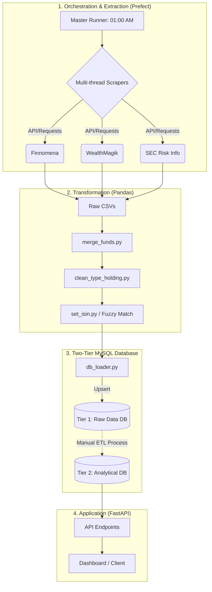

# 📈 Thai Mutual Fund Data Pipeline & API (V3.1.1)


**A production-ready data aggregation pipeline and API** designed to construct a comprehensive database of Thai Mutual Funds and Feeder Funds. 

Version 3.1.1 introduces a massive architectural upgrade: migrating away from Selenium to high-speed concurrent requests, implementing **Prefect** for robust workflow orchestration, and introducing a **Two-Tier Database System** powered by MySQL to serve a built-in **FastAPI** backend.

---

## 🚀 Key Features

* **⚡ High-Performance Extraction (No More Selenium):**
  * Transitioned from Selenium to pure `requests` for significantly faster execution.
  * Implemented **Multi-threading** (`ThreadPoolExecutor`) and dynamic User-Agent rotation (Windows, macOS, Linux) to bypass basic bot protections and accelerate data fetching.
* **🧠 Smart PDF Parsing & Fuzzy Matching:**
  * Uses `pdfplumber` to extract Factsheets and parse **ISIN codes** directly from documents.
  * Includes a server-friendly logic: PDF extraction runs **only once a month** to prevent IP bans.
  * Utilizes `thefuzz` for fuzzy string matching, accurately mapping fund names with the Stock Exchange of Thailand (SET) database.
* **🤖 Advanced Workflow Orchestration:**
  * Fully managed by **Prefect** (`@flow`, `@task`).
  * Features automated Cron scheduling (starts at 01:00 AM) and an intelligent Pause/Resume mechanism to handle retry rounds at 07:00 AM for failed tasks.
* **📊 Integrated FastAPI Backend:**
  * Includes a fully functional `API.py` using FastAPI to serve aggregated data, structured specifically for comprehensive dashboards (Thai Funds and Feeder Funds).

---

## 🏗️ System Architecture

The system is highly decoupled, operating through four distinct phases: Extraction, Transformation, Storage, and Serving.



---

## 🗄️ Database Design: Two-Tier System

To balance high-speed data ingestion with complex dashboard queries, the database is split into two logical tiers using **MySQL 8**:

### 📥 Tier 1: Raw Data / Staging (`thai_funds`)

* **Initialized by:** `init.sql`
* **Purpose:** Directly stores merged flat data from `db_loader.py`.
* **Tables:** `funds_master_info`, `funds_daily`, `funds_holding`, `funds_statistics`, etc.

### 📈 Tier 2: Analytical / Relational (`funds_API`)

* **Initialized by:** `funds.sql`
* **Purpose:** A highly structured, relational database designed specifically for the FastAPI backend and complex joins (Deep Look-through to underlying global stocks).
* **Tables:** `stocks`, `funds`, `master_funds`, `fund_direct_holdings`, `fund_master_holdings`.
* **⚠️ Important Note:** Currently, the ETL (Extract, Transform, Load) script to move and transform data from Tier 1 to Tier 2 is **not included**. Users must manually process or write a script to populate Tier 2 before using the API.

---

## 🛠️ Installation & Setup

### 1. Infrastructure (Database)

Start the **MySQL 8** and **PhpMyAdmin** containers:

```bash
docker-compose up -d

```

* **PhpMyAdmin UI:** `http://localhost:8080`
* **Credentials:** Username: `root` / Password: `1234`
* *(The Tier 1 schema `thai_funds` will automatically initialize on the first run via `init.sql`).*

### 2. Python Dependencies

Ensure you are using Python 3.9+.

```bash
pip install -r requirements.txt

```

### 3. Start the Pipeline

Run the Prefect orchestrator to begin the daily scraping cycle:

```bash
python master_runner.py

```

### 4. Start the API Server

Once your Tier 2 database is populated, launch the FastAPI server:

```bash
uvicorn API:app --reload

```

* **API Documentation (Swagger UI):** `http://127.0.0.1:8000/docs`

---

## 🇹🇭 สรุปการทำงานภาษาไทย (Thai Summary)

โปรเจกต์เวอร์ชัน 3.1.1 นี้ถูกอัปเกรดโครงสร้างใหม่ทั้งหมดเพื่อให้เทียบเท่าระดับ Production โดยมีจุดเปลี่ยนสำคัญดังนี้:

1. **ถอด Selenium ออก:** เปลี่ยนมาใช้การยิง Request ตรงๆ ร่วมกับการทำงานแบบขนาน (Multi-threading) ทำให้ดึงข้อมูลได้เร็วขึ้นหลายเท่าตัว และมีการสุ่ม User-Agent เพื่อป้องกันการถูกบล็อก
2. **ระบบจัดการ Workflow ด้วย Prefect:** สคริปต์หลัก (`master_runner.py`) ควบคุมโดย Prefect มีการตั้งเวลาทำงานอัตโนมัติตอนตี 1 และมีระบบฉลาดๆ ที่สามารถ Pause ตัวเองเพื่อไปเก็บตกข้อมูลที่พลาดในตอน 7 โมงเช้าได้
3. **การอ่าน PDF และ Fuzzy Match:** ระบบสามารถโหลดไฟล์ Factsheet มาอ่านด้วย `pdfplumber` เพื่อหาโค้ด ISIN ได้เอง (ตั้งค่าให้ทำแค่เดือนละ 1 ครั้งเพื่อถนอมเซิร์ฟเวอร์) และใช้ `thefuzz` จับคู่ชื่อกองทุนกับฐานข้อมูลตลาดหลักทรัพย์ (SET) ได้อย่างแม่นยำ
4. **ฐานข้อมูลแบบ 2 ชั้น (Two-Tier MySQL):**
* **Tier 1 (Raw Data):** เก็บข้อมูลดิบที่เพิ่งดูดมา (ใช้ `init.sql`)
* **Tier 2 (Analytical Data):** โครงสร้างแบบ Relational DB ที่พร้อมใช้ทำ Dashboard (ใช้ `funds.sql`)
* *(หมายเหตุ: ปัจจุบันยังต้องเขียน Script ย้ายข้อมูลจาก Tier 1 ไป Tier 2 เอง)*


5. **เพิ่ม FastAPI:** มีระบบ Backend เตรียมพร้อมสำหรับส่งข้อมูลไปแสดงผลบน Dashboard เรียบร้อยแล้ว

**การเริ่มต้นใช้งานเบื้องต้น:**

1. รัน `docker-compose up -d` เพื่อเปิดฐานข้อมูล MySQL
2. รัน `pip install -r requirements.txt`
3. รัน `python master_runner.py` เพื่อเริ่มระบบดูดข้อมูลอัตโนมัติ

---

*Project maintained by Atom. Generated for educational and data aggregation purposes.*