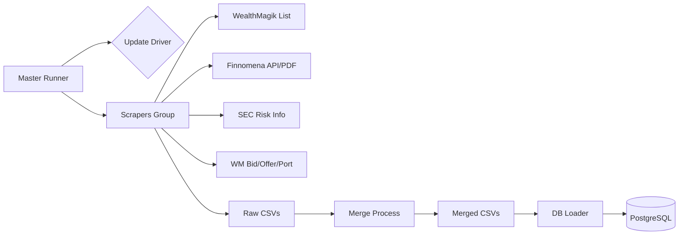

# 📈 Thai Mutual Fund Data Pipeline


**A production-ready data aggregation pipeline** designed to construct a comprehensive database of Thai Mutual Funds. This system intelligently scrapes, normalizes, and merges data from multiple sources (**Finnomena**, **WealthMagik**, and **SEC**) into a unified PostgreSQL database.

---

## 🚀 Key Features

* **🛡️ Resilient Architecture:**
    * **Smart Resume:** Automatically skips processed funds if interrupted.
    * **Dual-Round Execution:** Runs a second "Retry Round" 4 hours after the main run to catch any failed requests or network timeouts.
    * **Auto-Healing:** Automatically updates `geckodriver` to match the installed Firefox version.
* **🔗 Data Fusion:**
    * Combines **NAV History** from Finnomena with real-time **Bid/Offer** from WealthMagik.
    * Merges **Portfolios (Holdings)** from both sources for maximum coverage.
    * Enriches data with **Risk Metrics** (Sharpe, Alpha, Beta) directly from the SEC.
* **⚡ High Performance:**
    * Uses **Multithreading** for heavy scraping tasks (PDF parsing, Bid/Offer fetching).
    * **Vectorized Processing** (Pandas) for efficient data merging.
* **📦 Containerized Storage:**
    * Pre-configured **PostgreSQL** and **PgAdmin4** via Docker Compose.
    * Idempotent database loader (safe to re-run without duplicating data).

---

## 🏗️ System Architecture

The system operates as a **Single-Entry Orchestrator Model**. You only need to interact with **one** script.



| Component | Script | Description |
| --- | --- | --- |
| **👑 Orchestrator** | `master_runner.py` | **ENTRY POINT.** Manages scheduling, rounds, and process lifecycle. |
| **🕷️ Scrapers** | `scrape_finnomena.py`<br>

<br>`list_fund_wealthmagik.py`<br>

<br>`scrape_sec_info.py` | Extract data using API reversing, PDF parsing, and Headless Selenium. |
| **🌪️ Transformer** | `merge_funds.py` | Cleans, normalizes, and joins data from raw CSVs into unified datasets. |
| **💾 Loader** | `db_loader.py` | Upserts data into SQL tables using `ON CONFLICT DO UPDATE` strategies. |

---

## 🛠️ Installation & Setup

### 1. Prerequisites

* **Python 3.9+**
* **Docker & Docker Compose**
* **Mozilla Firefox** (Latest version installed on host)

### 2. Infrastructure (Database)

Start the PostgreSQL and PgAdmin containers:

```bash
docker-compose up -d

```
**Accessing the Database UI (PgAdmin):**
After starting the containers, access PgAdmin4 at `http://localhost:8080`

* **Email:** `atom@admin.com`
* **Password:** `admin`
* **Host Name/Address (for server connection):** `db`

**Tip:** You can customize these credentials (Username, Password, DB Name) by editing the environment variables in the `docker-compose.yml` file before starting the containers.

*Note: The database schema (`funds_db`) will be automatically initialized using `init.sql` on the first run.*


### 3. Python Dependencies

```bash
pip install -r requirements.txt

```

---

## ⚡ Usage

⚠️ **IMPORTANT:** Always run the pipeline through the master runner. Do not run individual scraper scripts manually unless debugging.

```bash
python master_runner.py

```

### Configuration (`master_runner.py`)

You can tweak the constants at the top of the file:

* `AUTO_MODE`: Set to `True` for continuous daily looping, `False` for a single run.
* `DAILY_START_TIME`: Time to start the daily scraping cycle (Default: `"04:30"`).
* `MODE_FOR_WEALTHMAGIK`:
* `1`: Sequential (Slowest, Most Stable)
* `2`: Hybrid (Recommended)
* `3`: Parallel (Fastest, High Resource Usage)


---

## 🗄️ Database Schema

The system populates the following tables in `funds_db`:

1. **`funds_master_info`**: Core fund details (AMC, Dividend Policy, Inception Date).
2. **`funds_daily`**: Time-series data for NAV, AUM, Bid, and Offer prices.
3. **`funds_statistics`**: Risk metrics (SD, Sharpe, Alpha, Beta, Drawdown) from SEC.
4. **`funds_fee`**: Front-end, Back-end, Management fees, and TER.
5. **`funds_holding`**: Top 5 or Full portfolio holdings (Stock/Bond names).
6. **`funds_allocations`**: Asset allocation (Equity/Fixed Income) and Country allocation.
7. **`funds_codes`**: Mapping of Fund Codes to ISIN codes parsed from Factsheets.

---

## 🇹🇭 Thai Summary

โปรเจกต์นี้คือ **"ระบบดูดและรวบรวมข้อมูลกองทุนรวมไทยแบบอัตโนมัติ"** ที่ถูกออกแบบมาให้ทำงานได้ด้วยตัวเองทุกวัน โดยมีจุดเด่นคือ:

1. **สั่งงานจุดเดียว:** รันแค่ไฟล์ `master_runner.py` ไฟล์เดียว ระบบจะจัดการทุกอย่างให้ (อัปเดต Driver -> ดูดข้อมูล -> รวมไฟล์ -> ลง Database)
2. **ระบบกันเหนียว (Dual-Round):** หากเน็ตหลุดหรือเว็บล่มในรอบแรก (04:30) ระบบจะรอ 4 ชั่วโมงแล้วตื่นมา "เก็บตก" เฉพาะกองทุนที่ยังไม่เสร็จให้โดยอัตโนมัติ
3. **ข้อมูลครบเครื่อง:** รวมข้อมูลจากทั้ง Finnomena (ข้อมูลพื้นฐาน/NAV), WealthMagik (Bid-Offer/พอร์ต) และ ก.ล.ต. (ค่าความเสี่ยง) มาไว้ในที่เดียว
4. **พร้อมใช้:** มี Docker Compose เตรียม Database (PostgreSQL) ไว้ให้พร้อมใช้งานทันที

**วิธีใช้งาน:**

1. รัน Docker: `docker-compose up -d`
* *สามารถเข้าดูข้อมูลผ่าน PgAdmin ได้ที่ `localhost:8080` (แก้ไข User/Pass ได้ในไฟล์ docker-compose.yml)*

2. ติดตั้ง Library: `pip install -r requirements.txt`
3. เริ่มระบบ: `python master_runner.py`

---

*Project maintained by Atom. Generated for educational and data aggregation purposes.*